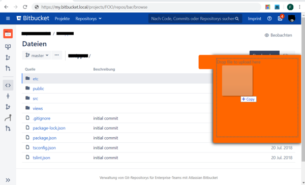
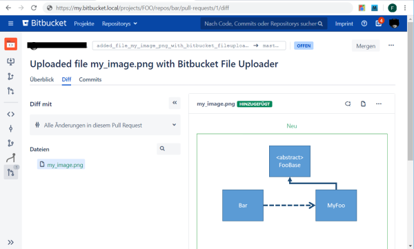

# Table of content
1. [Introduction](#introduction)
2. [Building and installing locally](#building-and-installing-locally)
3. [Roadmap](#roadmap)

# Introduction
bitbucket-file-uploader is a Chrome & Firefox extension that adds file upload function to bitbucket server web interface.

It adds a slide-out to the repository's file browser where you can simply drag'n'drop files to be uploaded.
It automatically creates a pull-request that adds the uploaded file to the current opened directory in the repository  
(see screenshots below) for the `master` branch





When uploading a file to a branch other than `master` the file is added as part of a new commit without opening a 
pull-request. This way it is also possible to upload multiple files as part of a single pull-request by uploading all
subsequent files to the branch created by uploading the first file.

The web interface shipped with bitbucket server by default lacks this very useful feature and apparently it is not 
planned to be included by Atlassian, see 
https://bitbucket.org/site/master/issues/12656/upload-images-or-binary-files-to-the-repo. 

Currently, the extension is not published in any public repository like Chrome Store or Firefox Add-ons, thus you have 
to build the extension yourself and manually activate it as an extension in your browser.

# Building and installing locally
Prerequisites:
* You need npm installed locally

```bash
git clone https://github.com/e-solutions-GmbH/bitbucket-file-uploader.git
cd bitbucket-file-uploader
npm install
npm run build
```

### Chrome
1. Navigate to `chrome://extensions`.
2. Check the box next to Developer Mode.
3. Choose "Load unpacked extension".
4. In the dialog, open the directory `bitbucket-file-uploader/dist/chrome`.
5. On the top right (next to the address bar) click on the bitbucket-file-uploader icon and choose "Options".
6. Input the base url of your Bitbucket (e.g. `https://bitbucket.mycompany.de`) and click "Update".

### Firefox
1. Navigate to `about:debugging#addons` to load add-on.
2. Click "Load Temporary Add-on".
3. In the dialog, open the directory `bitbucket-file-uploader/dist/ff` and select the `manifest.json` file.
4. Navigate to `about:addons` to open Add-ons Manager.
5. Choose "Options" for Bitbucket File Uploader.
6. Input the base url of your Bitbucket (e.g. `https://bitbucket.mycompany.de`) and click "Update".

# Roadmap
Below are some goals of this project (in order of priority):
- [x] Build as standard [web extension](https://developer.mozilla.org/de/docs/Mozilla/Add-ons/WebExtensions) to support most common browsers (chrome, firefox, ...) with a single code base
- [x] Support configuration for every local bitbucket environment (bitbucket home url)
- [x] Support easy-to-use, well integrated user interface for file uploads, including drag'n'drop
- [x] MVP that supports straight forward use-case: drag'n'drop a file into browser triggers creation of corresponding pull-request in the project
- [x] Provide comprehensive documentation in GitHub how to build and run the extension locally
- [ ] Replace generic icons with custom ones
- [ ] Improved build infrastructure with shared base manifest file that is merged with browser specific ones and support for other OS (Windows,...)
- [x] Support for multiple files to be uploaded in one pull-request
- [x] Support to add file(s) uploaded to an existing pull request
- [ ] Do not hardcode default target branch to `master`
- [ ] Publish the extension in Chrome Store / Firefox Add-ons etc.
